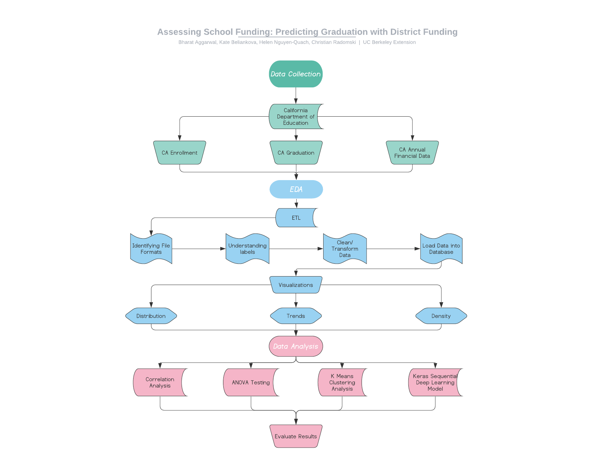

# Asessing School Funding: Predicting Graduation with District Funding  
## *Presented by Bharat Aggarwal, Kate Beliankova, Helen Nguyen-Quach, & Christian Radomski*

### Communication
* Messaging through Slack to discuss meeting times and share ideas
* Zoom Meeting on Tuesday, May 26 @ 7 pm to discuss role division and initial topic exploration
* Zoom Meeting on Wednesday, May 27 @ 7 pm to discuss datasets we have found and narrow down topic ideas
* Zoom Meeting on Thursday, May 27 @ 6:45 pm to finalize data set before class. During class we presented a pitch of our project.
* Zoom Meeting on Saturday, May 30 @ 7:00 pm to give update on deliverables
* Zoom Meeting on Sunday, May 31 @ 7:00 pm to go over requirements for deliverable and goals for next week
* Zoom Meeting on Wednesday, June 3 @ 7:00 pm to discuss roles for the next two weeks. Decided to hold the same roles from previous week.
* Class Meeting on Thursday June 4 @ 7:00 pm discussed during class plan to go forward with finalizing dataset, starting presentation, and discussing what visulizations to create.
* Zoom Meeting on Monday June 8 @ 9:00 pm to finalize features that will be used on predictive modeling. Decided on "Function" column.
* Class Meeting on Thursday June 11 @ 7:00 pm to share progress for deliverables due this week. Half of visualizations are complete and final dataset has been cleaned and should be ready for modeling. Received feedback on segment 1 deliverables and we need to connect machine learning model to a database.
* Zoom Meeting on Saturday June 14 @ 7 pm to discuss progress on data cleaning, modeling, EDA, and dashboard. Correlation, Clustering, and predicitve model did not give good results with actual data. '16-'17 data seems to have problems and taking out that data set or looking further into data cleaning is being considered. Visualizations and dashboard are coming along showing appropriate trends and distribution (except for '16-'17.

### Roles - Segment 1 & 2
■ Git Hub Repository/Presentation - **Christian**  
▲ Machine Learning Model - **Kate**  
● Database Mockup - **Helen**  
x Dashboard - **Bharat**  

### Topic: High School Graduation Rates Based on District Funding Patterns
We will be analyzing California school district data for the school years 2012 through 2017 to determine if there is a relation between district funding patterns and student success. We will measure student success by taking student enrollment and graduation amounts to determine graduation rate. Our steps for this project include attaining data from various years of school district data from a reliable source, cleaning the data to fit the parameters of our model, testing our model, and making a conclusion of our analysis on whether our hypothesis can be supported. Our goal is that our findings will help school districts in determining what programs to invest funds into.

### Data Source
The data that is being used in this analysis will be attained from the California Department of Education. 
* Datasets for CA Enrollment https://www.cde.ca.gov/ds/sd/sd/filesenr.asp
* Datasets for CA Graduation by Race and Gender https://www.cde.ca.gov/ds/sd/sd/filesgrads.asp
* Datasets for CA Annual Financial Data https://www.cde.ca.gov/ds/fd/fd/

### Research Questions
* Does school funding directly correlate to school performance? 
* Do the spending patterns of a school district impact student success/graduation rate?

### EDA
Steps in exploring the collected data and determining what can be analyzed includes:
* Identifying file formats and converting to appropriate format (CSV)
* Loading data into dataset
* Understanding column labels and identifying significant labels we will use for analysis (Fund/Function codes, Amount/Values, CDS Codes, Graduation/UC Graduation, Grade 12 enrollment, etc.)
* Data cleaning to transform data to fit the requirements for our model (Deleting unnecessary columns/rows, creating Graduation rate column, transforming function code and amounts)
* Creating visualizations to understand the distribution, trends, and density of the data

### Data Analysis
In addition to EDA, further analysis includes other statistical and machine learning modeling:
* **Correlation Analysis** to measure significance between overall funding and average graduation rates
* **ANOVA Testing** to determine if the difference between the null and alternative hypotheses 
    * H₀: There is no significant difference between graduation rates and funding
    * Hₐ: There is a significant difference between graduation rates and funding
* **K Means Clustering Analysis** to create a model that can accurately cluster data by graduation rate based on school district funding patterns
* **Keras Sequential Deep Learning Model** using linear activation to predict graduation rates based on school district funding patterns 

### Technologies Used
We have used quite a few technologies in this project so far. Below is a list of the same: 
* Slack and Zoom for Communication within the team
* Google Search Engine was used to explore data options
* Github to consolidate each member's work and merge to the master repository.
* Quickdatabasediagrams(https://www.quickdatabasediagrams.com/) to create the schema.
* Postgresql to load the data into the tables as per the schema defined.
* Python with Jupyter Notebook to draft the code and analyse the collected School data.
* Within python following modules were imported - Pandas, sklearn - Kmeans,sklearn - StandardScaler, sklearn - PCA, hvplot and plotlyexpress to conduct cluster analysis.
* For Prediction modelling, python modules were imported in jupyter notebook such as pandas, sklearn - StandardScaler,sklearn - OneHotEncoder, sklearn - train_test_split and tensorflow.
* We have also used ANOVA, where in we imported pandas, numpy, scipy stats and within stats we imported statsmodels.formula.api and statsmodels.api.
* Tableau will be used to create Dashboard

